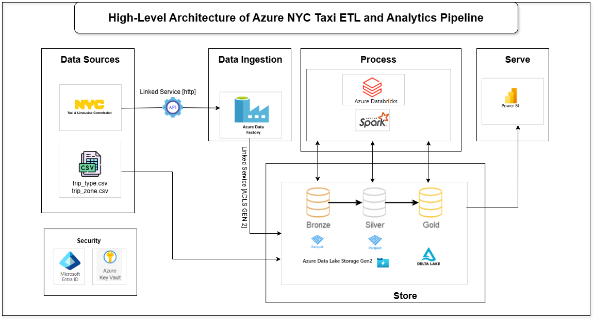

# Azure-NYC-Taxi-ETL-and-Analytics-Pipeline

## Project Description
The **Azure-NYC-Taxi-ETL-and-Analytics-Pipeline** is an end-to-end data engineering project designed to process NYC Taxi trip data using Azure services. This project automates the ingestion, transformation, and analysis of taxi trip data while implementing modern big data practices such as Medallion Architecture, Delta Lake, and dynamic pipelines. It integrates with Power BI to provide interactive analytics dashboards.

**Key Differentiator**: This project eliminates manual workflows by dynamically fetching data from APIs, automating pipelines with Azure Data Factory, and ensuring scalability with Delta Lake.

## Architecture

 

### High-Level Architecture

1. **Data Sources**: NYC Taxi trip data (Parquet format) and lookup files (manually uploaded CSV files).
2. **Data Ingestion**:
   - Built parameterized pipelines using Azure Data Factory to fetch data dynamically via API.
   - Stored raw data in the **Bronze Layer** of Azure Data Lake Gen2.
3. **Processing and Transformation**:
   - Used Azure Databricks and PySpark to clean and transform data.
   - Processed data through the Silver layer (structured and cleaned) and Gold layer (modeled for analytics).
4. **Data Modeling and Storage**:
   - Created Delta tables in the Gold layer for transactional support.
   - Stored data in **Delta Lake** for versioning and ACID compliance.
5. **Visualization**:
   - Connected Delta tables with Power BI to build interactive dashboards.

---

## Data Source
The project utilizes the **NYC Taxi Trip Data**, provided by the NYC Taxi & Limousine Commission. The data is stored in **Parquet format** and includes details about trip times, fares, pickup/drop-off locations, and more.

- **Source**: [NYC Taxi Data](https://www.nyc.gov/site/tlc/about/tlc-trip-record-data.page)

---

## Project Objectives
- **Automate Data Ingestion**: Dynamically fetch data from the NYC Taxi API into Azure Data Lake Gen2.
- **Implement Medallion Architecture**: Process data through Bronze (raw), Silver (transformed), and Gold (modeled) layers.
- **Optimize Data Storage**: Use Parquet and Delta Lake formats for scalability and transactional support.
- **Enable Analytics**: Create Power BI dashboards to analyze taxi trip patterns.
- **Ensure Security**: Utilize Azure IAM roles, Service Principal, and Key Vault for secure access.

---

## Technologies Used
- **Cloud Services**: Azure Data Factory, Azure Data Lake Gen2, Azure Databricks
- **Programming Languages**: Python (PySpark), SQL
- **File Formats**: Parquet, Delta Lake
- **Visualization**: Power BI
- **Security**: Azure IAM, Service Principal, Azure Key Vault

---

## Key Features
- **Automated Pipelines**:
  - Dynamically fetch and process data using Azure Data Factory.
- **Medallion Architecture**:
  - Process data through Bronze (raw), Silver (transformed), and Gold (modeled) layers.
- **Delta Lake**:
  - Store data with ACID compliance and enable efficient querying.
- **Power BI Integration**:
  - Build interactive dashboards for actionable insights.

---
